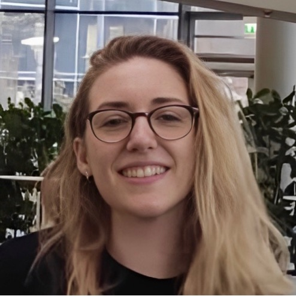

<!DOCTYPE html>
<html lang="en">
<head>
    <meta charset="UTF-8">
    <meta name="viewport" content="width=device-width, initial-scale=1.0">
    <title>Chania Clare</title>
    <link rel="stylesheet" href="https://cdnjs.cloudflare.com/ajax/libs/font-awesome/5.15.4/css/all.min.css">
    
</head>
<body>
    <header>
        
        <h1>Chania Clare</h1>
        
PhD Student | Computational Systems and Synthetic Biology

        <!-- Social Media Links -->
        

            <a href="https://www.linkedin.com/in/chania-clare/" target="_blank"><i class="fab fa-linkedin"></i></a>
            <a href="https://github.com/ChaniaClare" target="_blank"><i class="fab fa-github"></i></a>
            <a href="https://twitter.com/ChaniaNClare" target="_blank"><i class="fab fa-twitter"></i></a>
        

    </header>

    <section>
        <h2>About Me</h2>
        

           I’m a PhD student on the London Interdisciplinary Doctoral Programme (LIDo), where my work looks into the role of bacterial microcompartments in community dynamics though computational and wetlab techniques. I completed my Bachelor’s and Master’s degrees at Imperial College London, where I investigated electrotropism in plants, engineering cyanobacteria to support crop growth, and circadian-dependent immunity in the malaria parasite. As part of my PhD I completed a rotation project with the London School of Hygiene and Tropical Medicine and the Francis Crick Institute to identify novel drug targets for malaria parasite invasion. I thrive on tackling complex challenges and finding innovative solutions through data-driven research and interdisciplinary approaches.
        

        
        <section>
    <h2>Education and Research</h2>

    <h3>PhD, University College London (UCL) - BBSRC Doctoral Training Partnership</h3>
    

        <em>2021 – Present</em>
         
        Computational Systems and Synthetic Biology
    

    <ul>
        <li>Thesis: ‘Understanding the Role of the eut BMC in Microbial Community Dynamics’</li>
        <li>Conducted a 4-month research project at the London School of Hygiene and Tropical Medicine and the Crick Institute, identifying novel drug targets for malaria parasite invasion</li>
        <li>Routinely presented research to my research group, at internal events, and conferences</li>
        <li>Completed SysMIC computational modelling course and gained training in data science and machine learning</li>
        <li>Attended residential EMBL Data Carpentry course in Heidelberg to extend computational skills</li>
        <li>Major techniques: molecular biology, mathematical modelling, coding (Python, R, MATLAB, LaTeX)</li>
    </ul>

    <h3>Master of Research, Imperial College London</h3>
    

        <em>2018 - 2019</em>
         
        Molecular Plant and Microbial Sciences, MRes (Hons), Distinction
    

    <ul>
        <li>Chair of the Underwater Club, managing the administration and finances of an 80+ member society</li>
        <li>Initiated, designed, and executed two 6-month research projects focusing on electrotropism in plant roots and engineering cyanobacteria to produce a biofertilizer to support crop growth</li>
        <li>Supported the work of a start-up company, Bio-F Solutions, aiming to create a biofertilizer for sustainable agriculture</li>
        <li>Organiser of MRes Plant Science Journal Club</li>
        <li>Mentored and trained an undergraduate student in research skills and molecular biology techniques</li>
        <li>Class representative, collating concerns from students and addressing them in staff meetings</li>
    </ul>

    <h3>Bachelor of Science, Imperial College London</h3>
    

        <em>2015 - 2018</em>
         
        Biology, BSc (Hons), Upper Second Clas
    

    <ul>
        <li>Key modules: Plant Biotechnology, Integrative Systems Biology, and Synthetic Biology</li>
        <li>Completed a 3-month research project focusing on mosquito immune defense to the malaria parasite</li>
        <li>Undertook a 4-week ecological expedition to the rainforest in Guyana shield to collect data on selective-logging practices with severely limited resources</li>
        <li>Chair and equipment officer of the Underwater Club, organizing stores, maintenance, and access of sensitive equipment</li>
        <li>Assistant SCUBA diving instructor, teaching 20 students in the classroom and underwater, gaining training in First-Aid, Rescue Management, and Oxygen Administration</li>
    </ul>
</section>

        <h2>Projects Showcase</h2>
        

            Projects Showcase:
            <ol>
                <li>
                    <strong>Understanding the Role of the eut BMC in Microbial Community Dynamics (PhD Research)</strong>
                    
My ongoing PhD research at University College London delves into the intriguing role of the eut BMC (bacterial micro compartment) in Microbial Community Dynamics. By combining computational modeling, statistical analysis, and molecular biology techniques, I aim to shed light on the significance of these specialized compartments in bacterial communities and how they contribute to ecosystem functions. Routinely presenting my research findings to my research group and at conferences has honed my communication skills and allowed me to engage with fellow researchers on this captivating topic.

                </li>
                <li>
    <strong>Functional Analysis of Cyclic AMP Signalling Effectors in Malaria Parasite Erythrocyte Invasion</strong> 
    
 During my 4-month research project with David Baker at the London School of Hygiene and Tropical Medicine and Mike Blackman at the Francis Crick Institute, I investigated novel drug targets for malaria parasite invasion. My work focused on the critical role of cyclic AMP (cAMP) signalling effectors in erythrocyte invasion, aiming to identify potential therapeutic interventions against malaria. Utilizing advanced molecular biology techniques, including CRISPR-Cas9 gene editing, I worked to investigate the involvement of cAMP signalling pathways in parasite invasion efficiency. 

                </li>
                <li>
                    <strong>Engineering Cyanobacteria for Sustainable Agriculture (Master's Research)</strong>
                    
During my Master's at Imperial College London, I undertook a challenging research project focused on engineering cyanobacteria to produce a biofertilizer supporting crop growth. This innovative approach holds immense potential for sustainable agriculture, reducing our reliance on traditional fertilizers. Collaborating with the start-up company, Bio-F Solutions, allowed me to apply my scientific knowledge to real-world challenges and contribute to the development of eco-friendly agricultural solutions.

                </li>
                <li>
                    <strong>Investigating Mosquito Immune Defense to the Malaria Parasite (Bachelor's Research)</strong>
                    
My undergraduate research project at Imperial College London explored the intricate immune defense mechanisms of mosquitoes against the malaria parasite. Through rigorous experimentation and statistical analysis, I gained insights into the mosquito's response to the parasite's invasion, contributing to our understanding of malaria transmission. This project kindled my passion for molecular biology and its implications in combating infectious diseases.

                </li>
            </ol>
        

        <!-- Add any additional sections here -->

    </section>

    <section>
        <!-- Continue with additional sections, if any -->
    </section>

    <footer>
        
&copy; 2023 Chania Clare. All rights reserved.

    </footer>

    <!-- JavaScript for fetching and displaying Twitter posts -->
    
    

  
</body>
</html>
